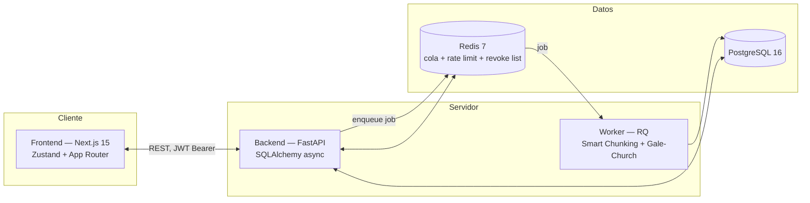

# MCH-English

**Aprendé inglés escribiéndolo, no leyéndolo.**

MCH-English es una app de práctica de mecanografía en inglés diseñada para construir memoria muscular real: cada palabra que fallás queda registrada como vocabulario débil, cada sesión suma XP y racha, y todo el pipeline de idioma — traducción, alineación de oraciones, diccionario, voz — es determinístico y corre localmente. **Cero IA generativa, cero APIs externas de traducción o de voz, cero dependencias opacas.**

[](https://nextjs.org/)
[](https://fastapi.tiangolo.com/)
[](https://www.postgresql.org/)
[](https://redis.io/)
[](https://docs.docker.com/compose/)
[](./docs/ARCHITECTURE.md#testing)
[](./docs/ARCHITECTURE.md#testing)
[](https://github.com/EdilsonDeveloper135/MCH-English/actions/workflows/ci.yml)
[](./LICENSE)

---

## ¿Por qué existe esto?

Las apps de mecanografía (Monkeytype, Keybr, TypeRacer) son excelentes para velocidad pura, pero no enseñan idioma. Las apps de idioma (Duolingo y similares) rara vez construyen la memoria muscular de escribir el idioma de verdad. MCH-English está en el medio a propósito: **el texto que practicás es el que vos elegiste** (un libro, un artículo, una letra de canción), y la traducción/contexto que ves es la que **vos mismo escribiste** — no una traducción automática que podría estar mal y que no vas a cuestionar.

## Características principales

### Motor de mecanografía moderno
- **Smooth Caret** — el cursor se interpola por CSS/hardware en vez de saltar carácter a carácter, igual que Monkeytype.
- **Borrado atómico de palabra** (`Ctrl+Backspace` / `Cmd+Backspace`) — descartá una palabra entera fallada en un solo golpe, sin machacar Backspace letra por letra.
- **Buffer de caracteres extra** — tipear de más al final de una palabra no rompe el estado del ejercicio; queda registrado como error sin desalinear el cursor.
- **Feedback sonoro opcional** (4 perfiles, configurables en Ajustes) y **Modo Zen** con paletas antifatiga (Nord, Catppuccin, Sepia, OLED).
- **Ghost Runner y telemetría por tecla** — registro de precisión histórica por carácter y curva de cadencia downsampled para comparar tu progreso.
- **Navegación por teclado y hotkeys globales** — `Enter`/`Espacio` para avanzar en rondas, `Ctrl+Espacio` y `Alt+R` para audio en Dictation, y paleta global con `⌘K` / `Ctrl+K`.

### Modos de práctica
- **Lectura guiada por chunks** — Smart Chunking divide cualquier texto en fragmentos de 30–150 palabras sin cortar oraciones a la mitad.
- **Práctica libre (QuickType)** — modo efímero inmediato (`/quicktype`) para pegar y tipear cualquier fragmento al instante con chunking en el navegador, sin guardarlo en base de datos.
- **Palabras débiles** — sesiones generadas automáticamente a partir de tu propio historial de errores y decaimiento de dominio.
- **Recall (Missing Words & Español → Inglés)** — se ocultan palabras clave de oraciones practicadas o se tipea por traducción inversa guiada por alineación bilingüe.
- **Dictation** — síntesis de voz local fonética (eSpeak-NG) y escritura al dictado con repetición y ajuste de velocidad.

### Gestión de textos e importación local
- **Importador local de PDF y ePub** — extracción de texto 100% en el cliente con `pdfjs-dist` y `epubjs` directamente en el navegador, con cero llamadas de red y total privacidad offline.
- **Alineación Gale-Church interactiva** — editor visual para verificar y corregir el emparejamiento de oraciones inglés-español (`/library/[textId]/align`).
- **Anotaciones pedagógicas** — soporte para notas gramaticales y frases idiomáticas por oración.

### PWA y soporte offline
- **App web progresiva (PWA)** — instalable en escritorio y dispositivos móviles con manifest y soporte standalone.
- **Sincronización Outbox resiliente** — Service Worker propio (`sw.js`) con precaché del shell, almacenamiento de audios en IndexedDB y cola de salida que guarda las sesiones completadas sin internet y las sincroniza automáticamente al reconectar.

### Estadísticas avanzadas, analítica y vocabulario
- **Gráficos en SVG puro** — curva de evolución de WPM (`WpmTrendChart`), calendario de calor de precisión estilo GitHub (`AccuracyHeatmap`) y análisis de patrones de error (`ErrorPatternChart`).
- **Historial paginado y exportación CSV** — tabla interactiva ordenada con descarga de métricas en formato CSV estándar.
- **Explorador de vocabulario** — panel en `/vocabulary` con cálculo de Mastery Score, frecuencia de errores y definiciones de FreeDict eng-spa.

### Gamificación
- XP, niveles progresivos, racha diaria calculada según la **zona horaria local** del usuario y catálogo de 12 logros con galería dedicada (`/achievements`), toasts y badges.
- Modal de resumen post-sesión con desglose de WPM neto, precisión y palabras con fallo.

## Arquitectura



Detalle completo del flujo de datos (Smart Chunking → Gale-Church → FreeDict → RQ Worker → Zustand) en [`docs/ARCHITECTURE.md`](./docs/ARCHITECTURE.md).

## Inicio rápido

**Requisitos:** [Docker](https://docs.docker.com/get-docker/) y Docker Compose (viene incluido con Docker Desktop).

```bash
git clone https://github.com/EdilsonDeveloper135/MCH-English.git
cd MCH-English
cp .env.example .env
# Clave de firma de los JWT: el backend no arranca sin una propia (mínimo 32 chars)
printf 'SECRET_KEY=%s\n' "$(openssl rand -hex 32)" >> .env
docker compose up -d
```

Eso levanta los 5 servicios (`frontend`, `backend`, `worker`, `postgres`, `redis`) y corre las migraciones de Alembic automáticamente. Dale unos 20-30 segundos a que todo pase a `healthy`:

```bash
docker compose ps
```

- **App:** [http://localhost:3000](http://localhost:3000)
- **API (Swagger/OpenAPI):** [http://localhost:8000/docs](http://localhost:8000/docs)
- **Healthcheck:** `curl http://localhost:8000/health`

No hay una cuenta de prueba precargada (a propósito — no queremos un usuario semilla con datos falsos en la base). Registrá tu propia cuenta desde `/register`, o directo por API:

```bash
curl -X POST http://localhost:8000/auth/register \
  -H "Content-Type: application/json" \
  -d '{"email":"tu@email.com","password":"unpasswordde8caracteresomas"}'
```

La respuesta trae el `access_token` (JWT) para usar en el resto de los endpoints con `Authorization: Bearer <token>`.

## Comandos para desarrolladores

Todo corre **dentro de los contenedores** — no hace falta Node ni Python instalados en el host.
Los comandos de frontend necesitan el override de desarrollo (la imagen base es la de
producción: `standalone`, sin devDependencies ni código fuente):

```bash
docker compose -f docker-compose.yml -f docker-compose.dev.yml up -d

# Tests de backend (110 tests)
docker exec mch-english-backend-1 pytest -v

# Tests de frontend (113 tests)
docker exec mch-english-frontend-1 npm test

# Linter y tipos de frontend
docker exec mch-english-frontend-1 npm run lint
docker exec mch-english-frontend-1 npx tsc --noEmit

# Build de producción del frontend (verifica que las 15 rutas compilen)
docker exec mch-english-frontend-1 npm run build

# Nueva migración de base de datos (tras cambiar un modelo)
docker compose exec backend alembic revision --autogenerate -m "descripcion del cambio"
docker compose exec backend alembic upgrade head

# Logs en vivo de un servicio
docker compose logs -f backend
```

### Estructura del repo

```
MCH-English/
├── frontend/          # Next.js 15 (App Router) + TypeScript + Tailwind + Zustand + PWA
├── backend/           # FastAPI + SQLAlchemy async + Alembic + Pydantic v2
│   ├── app/
│   │   ├── api/       # Routers HTTP
│   │   ├── services/  # Lógica de dominio pura (chunking, alignment, gamification...)
│   │   ├── repositories/
│   │   ├── models/    # Tablas SQLAlchemy
│   │   ├── workers/   # Jobs de RQ (procesamiento de texto en background)
│   │   └── tests/     # pytest — unitarios + integración HTTP
│   └── data/          # Diccionario FreeDict eng-spa (datos abiertos, ver NOTICE.md)
├── docs/
│   ├── ARCHITECTURE.md
│   ├── ISSUES_AND_ROADMAP.md
│   └── audits/        # Historial de auditorías y planes de remediación
├── docker-compose.yml           # Base — puertos 3000/8000 expuestos por default
├── docker-compose.dev.yml       # Override de desarrollo (hot-reload, puertos DB expuestos)
└── docker-compose.prod.yml      # Override de producción (restart policies, sin exponer DB)
```

## Documentación adicional

- [`docs/ARCHITECTURE.md`](./docs/ARCHITECTURE.md) — flujo de datos completo, módulos frontend/backend, decisiones de seguridad y testing.
- [`docs/ISSUES_AND_ROADMAP.md`](./docs/ISSUES_AND_ROADMAP.md) — roadmap del proyecto y funcionalidades futuras (modo multijugador con WebSockets, backlog).
- [`docs/audits/`](./docs/audits/) — historial completo de auditorías técnicas y planes de remediación ya cerrados.

## Licencia

[MIT](./LICENSE) — usalo, modificalo, lo que quieras.
